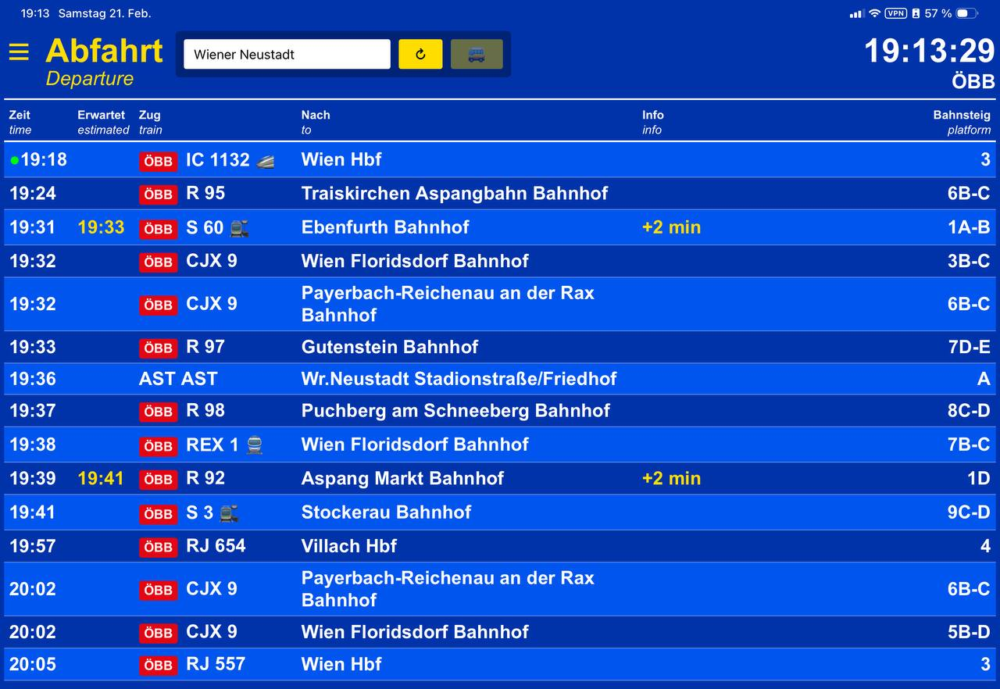
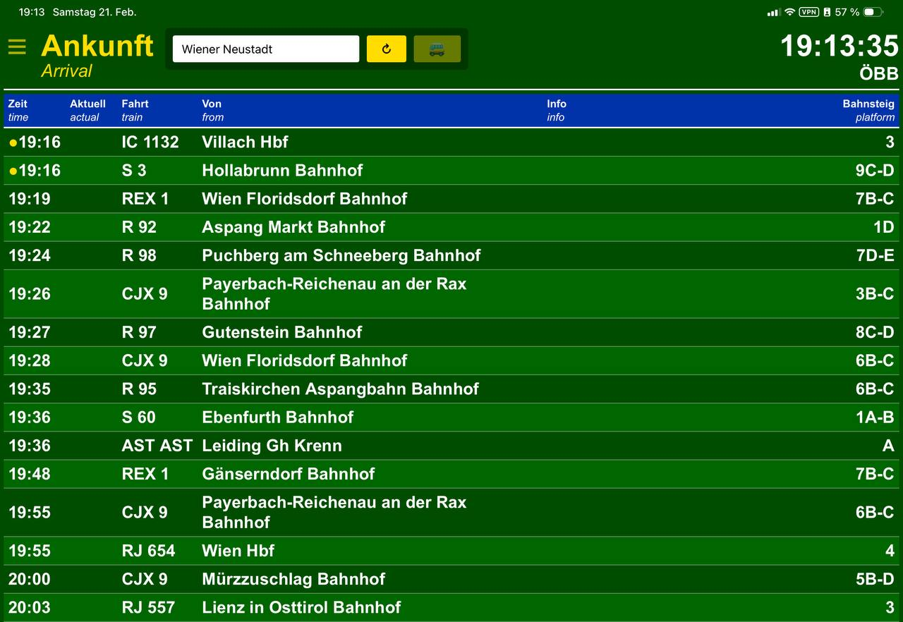

# 🚂 ÖBB Fahrplan Monitor

> **Echtzeit-Abfahrtsmonitor für österreichische Bahnhöfe als Progressive Web App**

[](LICENSE)
[](https://craith.cloud/oebb)
[](https://github.com/RaithChr)

**Live Demo:** [craith.cloud/oebb](https://craith.cloud/oebb)

---

## 📸 Screenshots

### Abfahrtsmodus (Blau)

*Echtzeit-Abfahrten mit Betreiber-Logos, Zugtyp-Emojis und Ziel-Flags*

### Ankunftsmodus (Grün)

*Ankunftsübersicht mit Herkunftsinformationen*

---

## ✨ Features

### 🚂 Kern-Funktionen
- ✅ **Echtzeit-Daten** direkt von der ÖBB HAFAS API
- ✅ **Abfahrt ↔ Ankunft** umschaltbar mit einem Klick (☰ Button)
- ✅ **Bus-Filter** (🚌 Button) - Busse ein/ausblenden nach Bedarf
- ✅ **Wiener Linien Filter** (WL Button) - U-Bahn, Tram, Busse ausblenden (standardmäßig aus)
- ✅ **Auto-Refresh** alle 15 Sekunden für aktuelle Daten
- ✅ **Station-Suche** mit Autocomplete für alle österreichischen Bahnhöfe
- ✅ **Umlaut-Normalisierung** - "Mödling" funktioniert genauso wie "Modling"
- ✅ **Letzte Station merken** - wird automatisch beim nächsten Start geladen
- ✅ **Dynamische Systemwarnungen** - zeigt Verspätungen, Ausfälle & Pünktlichkeit
- ✅ **Spenden-Buttons** (☕ Buy Me A Coffee & 💳 PayPal)

### 🎨 Design & UX
- ✅ **ÖBB-Original-Design** - Blau (#0033aa) für Abfahrt, Grün (#004d00) für Ankunft
- ✅ **Zebra-Striping** für bessere Lesbarkeit
- ✅ **Responsive Layout** - optimiert für Mobile & Desktop
  - 🖥️ Desktop: Input + Buttons in einer Zeile
  - 📱 Mobile: Input in separater Zeile, Buttons darunter
- ✅ **Blinkende Status-Punkte** nach ÖBB-Legende:
  - 🟢 **Grün:** 3-5 Minuten bis Abfahrt
  - 🟡 **Gelb:** 0-2 Minuten (gleich geht's los!)
  - ⚪ **Weiß:** Bereit zum Einsteigen
  - 🔴 **Rot:** Zug fällt aus
- ✅ **Dynamische Footer-Warnungen:**
  - 🟢 **Grün:** Alle Züge fahren pünktlich
  - 🟡 **Gelb:** Einzelne Ausfälle/Verspätungen
  - 🟠 **Orange:** >50% Verspätungen
  - 🟠 **Orange-Rot:** >20% Zugausfälle

### 🏢 Multi-Operator Support
Automatische Erkennung und farbcodierte Logos für:
- 🔴 **ÖBB** (Rot) - S-Bahn, REX, IC, EC, RJ, Nightjet
- 🟢 **Westbahn** (Grün)
- 🔴 **DB** (Deutsche Bahn) - bei internationalen Zügen
- 🔵 **Wiener Linien** (Blau) - U-Bahn, Straßenbahn, Busse

### 🚄 Smarte Emojis

**Zugtyp-Kennzeichnung:**
- 🚄 EuroCity / InterCity (Fernverkehr)
- 🚉 S-Bahn (Nahverkehr)
- 🚆 REX (Regional Express)

**Internationale Ziele:**
- ✈️ Flughäfen (Wien, Salzburg, etc.)
- 🇩🇪 Deutschland (Berlin, München, Frankfurt, ...)
- 🇨🇭 Schweiz (Zürich, Bern, Basel, Genf)
- 🇮🇹 Italien (Rom, Venedig, Mailand, Florenz)
- 🇭🇺 Ungarn (Budapest)
- 🇨🇿 Tschechien (Prag, Brno)
- 🇸🇰 Slowakei (Bratislava)
- 🏔️ Alpine Regionen (Innsbruck, Salzburg, Kitzbühel)

### 🔔 Intelligente Systemwarnungen

Die Footer-Box zeigt automatisch Informationen basierend auf den echten Zugdaten:

| Situation | Anzeige | Farbe | Beispiel |
|-----------|---------|-------|----------|
| **Alle pünktlich** | ✅ Alle Züge fahren planmäßig | 🟢 Grün | ✅ Alle Züge fahren planmäßig (12/12) |
| **Einzelne Probleme** | ℹ️ Ausfälle & Verspätungen | 🟡 Gelb | ℹ️ 1 Ausfälle, 3 Verspätungen - 8/12 pünktlich |
| **Viele Verspätungen** | ⏱️ >50% mit Verspätung | 🟠 Orange | ⏱️ Viele Züge mit Verspätung (8/12) |
| **Mehrere Ausfälle** | ⚠️ >20% Zugausfälle | 🟠 Orange-Rot | ⚠️ Mehrere Zugausfälle gemeldet (4/12) |

Diese Warnungen aktualisieren sich **live** bei jedem Laden und helfen dir, schnell das Verkehrschaos zu erkennen!

### 📱 Progressive Web App (PWA)
- ✅ **Installierbar** als native App auf Android & iOS
- ✅ **Offline-Support** - letzte Daten werden gecacht
- ✅ **Fullscreen-Modus** - keine Browser-UI beim Start
- ✅ **App-Icon** mit OE3LCR Branding
- ✅ **Service Worker** für schnelle Ladezeiten

---

## 🚀 Installation

### Voraussetzungen
- PHP 7.4 oder höher
- Apache oder nginx Webserver
- HTTPS (für PWA-Funktionalität)

### Setup

1. **Repository klonen:**
```bash
git clone https://github.com/RaithChr/oebb-fahrplan-monitor.git
cd oebb-fahrplan-monitor
```

2. **Auf Webserver deployen:**
```bash
# Beispiel für Apache
sudo cp -r * /var/www/html/oebb/
sudo chown -R www-data:www-data /var/www/html/oebb/
```

3. **Webserver konfigurieren:**
```apache
# Apache .htaccess
AddDefaultCharset UTF-8
```

4. **Fertig!** Öffne im Browser:
```
https://deine-domain.de/oebb/
```

### Als PWA installieren

**Android (Chrome/Edge):**
1. Öffne die Seite im Browser
2. Menü (⋮) → **"App installieren"**
3. Bestätigen → Fertig!

**iOS (Safari):**
1. Öffne die Seite in Safari
2. Teilen-Button (□↑) → **"Zum Home-Bildschirm"**
3. "Hinzufügen" → Fertig!

---

## 🔧 Technische Details

### Stack
- **Frontend:** Vanilla JavaScript (kein Framework)
- **Backend:** PHP 7.4+ (API Proxy)
- **API:** ÖBB HAFAS (kein API-Key erforderlich)
- **PWA:** Service Worker + manifest.json

### Architektur
```
┌─────────────────┐
│   Browser/PWA   │
└────────┬────────┘
         │
    ┌────▼────┐
    │ script.js│ ← UI Logic, Live-Updates
    └────┬────┘
         │
┌────────▼────────────┐
│ fetch-departures.php│ ← PHP Proxy
└────────┬────────────┘
         │
┌────────▼─────────┐
│ ÖBB HAFAS API    │ ← Echtzeit-Daten
└──────────────────┘
```

### Browser-Kompatibilität
- ✅ Chrome/Edge (Desktop & Mobile)
- ✅ Safari (macOS & iOS)
- ✅ Firefox
- ✅ Opera

### Performance
- **Initial Load:** ~50 KB (mit Icons)
- **Cached Load:** <10 KB (Service Worker)
- **API Response:** ~1-2 Sekunden
- **Auto-Refresh:** 15 Sekunden Intervall

### Smart Features
- **Umlaut-Normalisierung:** Funktioniert mit ä/ö/ü
  - Input: "Mödling" → API-Call: "Modling"
  - Input: "Öblarn" → API-Call: "Oblarn"
- **Encoding-Konvertierung:** ÖBB API (ISO-8859-1) → UTF-8
- **Dynamische Warnungen:** Echtzeit-Analyse der Zugdaten
- **Mobile-Responsive:** Separate Zeilen auf Portrait-Ansicht

---

## 📂 Projektstruktur

```
oebb-fahrplan-monitor/
├── index.php              # Hauptseite + PWA Meta-Tags
├── fetch-departures.php   # ÖBB API Proxy (Abfahrt/Ankunft)
├── autocomplete.php       # Stationssuche
├── script.js              # Frontend-Logik (15 KB)
├── style.css              # Styling (8 KB)
├── manifest.json          # PWA Manifest
├── sw.js                  # Service Worker
├── icon-192.png           # App-Icon (192x192)
├── icon-512.png           # App-Icon (512x512)
├── LICENSE                # MIT Lizenz
└── README.md              # Diese Datei
```

---

## 🔌 API

Das Projekt nutzt die **öffentliche ÖBB HAFAS API** ohne Authentifizierung:

- **Abfahrten/Ankünfte:** `fahrplan.oebb.at/bin/stboard.exe/dn`
- **Stationssuche:** `fahrplan.oebb.at/bin/ajax-getstop.exe/dn`
- **Kein API-Key erforderlich**
- **Rate Limit:** Keine bekannten Einschränkungen

---

## 🛡️ Sicherheit

- ✅ **Input-Validierung** auf allen User-Inputs
- ✅ **XSS-Schutz** via `html_entity_decode()`
- ✅ **Keine Credentials** im Code
- ✅ **HTTPS required** für PWA-Features
- ✅ **Content Security Policy** ready

---

## 🤝 Contributing

Contributions sind willkommen! Bitte beachte:

1. Fork das Repository
2. Erstelle einen Feature Branch (`git checkout -b feature/AmazingFeature`)
3. Committe deine Änderungen (`git commit -m 'Add some AmazingFeature'`)
4. Pushe zum Branch (`git push origin feature/AmazingFeature`)
5. Öffne einen Pull Request

Siehe [CONTRIBUTING.md](CONTRIBUTING.md) für Details.

---

## 📜 Lizenz

Dieses Projekt ist unter der **MIT-Lizenz** lizenziert - siehe [LICENSE](LICENSE) Datei für Details.

---

## 💖 Support

Wenn dir dieses Projekt gefällt, unterstütze mich gerne:

[](https://www.buymeacoffee.com/christianraith)
[](https://paypal.me/christianraith151)

---

## 👤 Autor

**Christian Raith (OE3LCR)**

- 📍 QTH: JN87ct (Wien, Österreich)
- 🐙 GitHub: [@RaithChr](https://github.com/RaithChr)
- 📧 Email: raith.mobile@gmail.com
- 📡 Callsign: OE3LCR

---

## 🙏 Danksagungen

- **ÖBB** für die öffentliche HAFAS API
- **Open Source Community** für Tools & Inspiration
- **Ham Radio Community** für Feedback & Support

---

## 🗓️ Changelog

### v1.2.0 (2026-02-24) 🚀 LATEST
- ✨ **Umlaut-Normalisierung** für Stationssuche (ä→a, ö→o, ü→u)
- 🔍 Autocomplete funktioniert mit Umlauten (Mödling, Öblarn, etc.)
- ⚠️ **Dynamische Systemwarnungen** basierend auf Zugstatistiken
  - Zeigt Verspätungsrate, Ausfallrate, Pünktlichkeit
  - Farbcodierte Footer-Box (grün/gelb/orange/rot)
- 📱 **Mobile Layout verbessert** - Input-Feld in separater Zeile
- ☕ **Spenden-Buttons** - Buy Me A Coffee & PayPal Integration
- 🔧 **Encoding-Fixes** - ISO-8859-1 → UTF-8 Konvertierung
- 🛡️ **Service Worker Fix** - Chrome-Extension URLs werden nicht gecacht
- 🧹 **Code Cleanup** - Debug-Logs und Test-Code entfernt

### v1.1.0 (2026-02-21)
- ✨ Add: Wiener Linien Toggle (WL Button)
- 🚇 Filter für U-Bahn, Straßenbahn, Busse in Wien
- 💾 State in localStorage gespeichert
- 🎨 Standardmäßig ausgeblendet

### v1.0.0 (2026-02-21)
- ✨ Initial Release
- 🚂 Echtzeit-Abfahrten & Ankünfte
- 📱 PWA-Funktionalität
- 🏢 Multi-Operator Support
- 🎯 Smarte Emojis für Zugtypen & Ziele
- 🔄 Auto-Refresh & Bus-Filter

---

⭐ **Wenn dir dieses Projekt gefällt, gib ihm einen Stern auf GitHub!** ⭐

**Made with ❤️ in Austria 🇦🇹**
